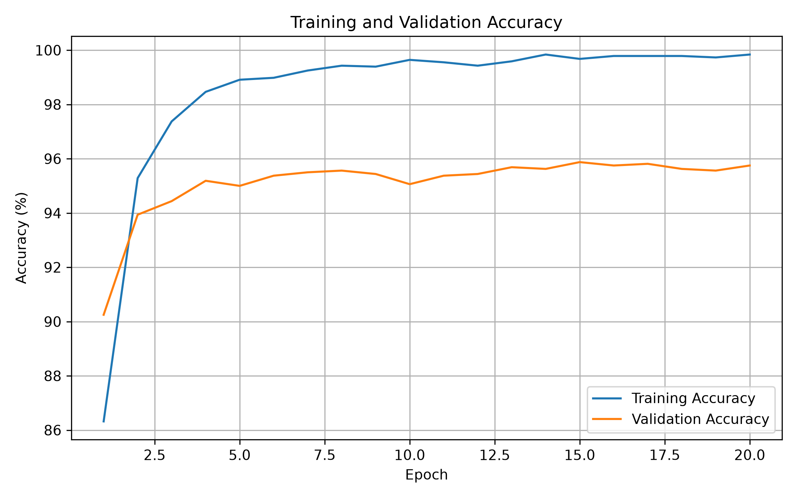
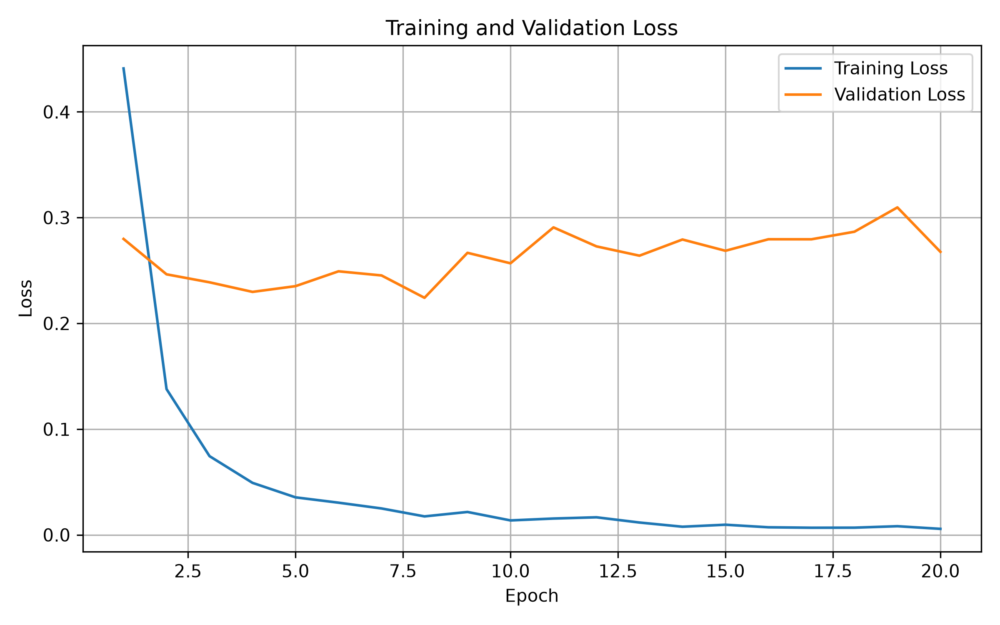
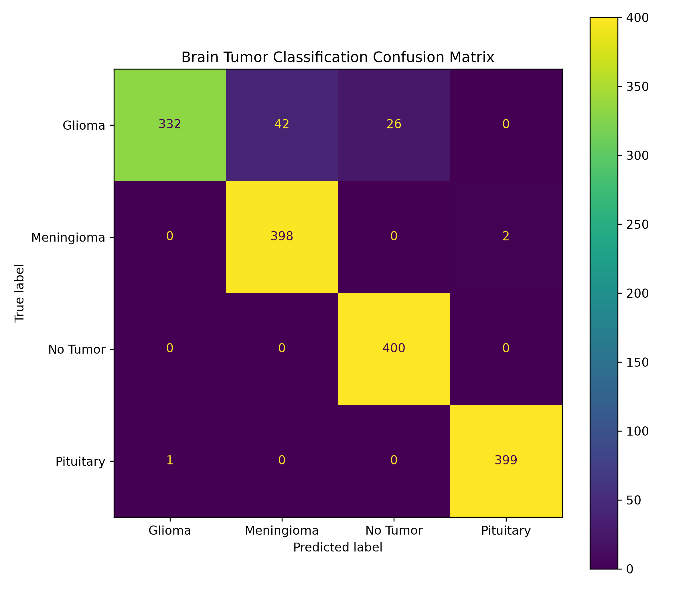

# 🧠 Brain Tumor Classification using EfficientNet-B0 and PyTorch

An end-to-end deep learning project for multiclass brain MRI classification using **PyTorch**, **EfficientNet-B0 transfer learning**, and **Streamlit**.

The model classifies MRI images into four categories:

- Glioma
- Meningioma
- No Tumor
- Pituitary Tumor

The project demonstrates a complete machine learning engineering workflow, from dataset preparation and preprocessing to model training, evaluation, inference, testing, and deployment.

---

## 📌 Project Overview

Brain tumor classification from MRI images is a challenging computer vision problem because different tumor types can have visually similar characteristics.

This project uses **transfer learning with EfficientNet-B0**, pretrained on ImageNet, to extract meaningful visual features from MRI scans and perform four-class classification.

The project is structured as a modular machine learning engineering application rather than a single training notebook.

### Workflow

```text
MRI Dataset
     │
     ▼
Data Preprocessing
     │
     ▼
Custom PyTorch Dataset
     │
     ▼
EfficientNet-B0
Transfer Learning
     │
     ▼
Model Training
     │
     ▼
Evaluation
     │
     ├── Accuracy
     ├── Classification Report
     └── Confusion Matrix
     │
     ▼
Single Image Inference
     │
     ▼
Streamlit Web Application
```

---

## 🚀 Features

- EfficientNet-B0 transfer learning
- ImageNet pretrained weights
- Custom PyTorch Dataset
- PyTorch DataLoader
- Modular preprocessing pipeline
- Training and validation engine
- Model checkpointing
- Learning-rate scheduling
- Classification report
- Confusion matrix
- Single-image prediction
- Class probability estimation
- Interactive Streamlit application
- Unit tests for core components
- Reproducible project structure

---

## 📂 Project Structure

```text
brain-tumor-classification/
│
├── app/
│   └── app.py
│
├── checkpoints/
│   └── best_model.pth
│
├── data/
│   ├── raw/
│   └── processed/
│
├── notebooks/
│   └── eda.ipynb
│
├── outputs/
│   └── figures/
│       ├── accuracy_curve.png
│       ├── loss_curve.png
│       └── confusion_matrix.png
│
├── src/
│   ├── __init__.py
│   ├── config.py
│   ├── preprocess.py
│   ├── dataset.py
│   ├── model.py
│   ├── engine.py
│   ├── train.py
│   ├── evaluate.py
│   └── predict.py
│
├── tests/
│   ├── __init__.py
│   ├── test_config.py
│   ├── test_dataset.py
│   ├── test_dataloader.py
│   ├── test_model.py
│   └── test_preprocess.py
│
├── requirements.txt
├── README.md
└── .gitignore
```

---

## 📊 Dataset

**Dataset:** Brain Tumor MRI Dataset

The dataset contains four classes:

| Class | Training Images | Testing Images |
|---|---:|---:|
| Glioma | 1,400 | 400 |
| Meningioma | 1,400 | 400 |
| No Tumor | 1,400 | 400 |
| Pituitary | 1,400 | 400 |
| **Total** | **5,600** | **1,600** |

The dataset is not included in this repository because of its size and GitHub storage considerations.

After downloading and extracting the dataset, the expected structure is:

```text
data/raw/
├── Training/
│   ├── glioma/
│   ├── meningioma/
│   ├── notumor/
│   └── pituitary/
│
└── Testing/
    ├── glioma/
    ├── meningioma/
    ├── notumor/
    └── pituitary/
```

---

## 🧠 Model

### Architecture

**EfficientNet-B0**

The model uses ImageNet pretrained weights and transfer learning for MRI image classification.

### Configuration

- Architecture: EfficientNet-B0
- Learning approach: Transfer Learning
- Input size: 224 × 224
- Output classes: 4
- Loss function: CrossEntropyLoss
- Optimizer: Adam
- Learning-rate scheduler: ReduceLROnPlateau
- Framework: PyTorch

---

# 📈 Results

The final model was evaluated on the **1,600-image held-out testing dataset**.

## Overall Performance

### **Test Accuracy: 95.56%**

| Metric | Value |
|---|---:|
| Training Accuracy | ~99.8% |
| Test Accuracy | **95.56%** |

The difference between training and testing performance indicates some degree of overfitting, while the model maintains strong classification performance on the held-out dataset.

---

## Training Accuracy



The model rapidly learns useful visual features during the first few epochs and reaches approximately 99.8% training accuracy.

---

## Training and Validation Loss



Training loss decreases substantially throughout training, while the held-out loss remains higher and fluctuates during later epochs.

---

## Confusion Matrix



The confusion matrix shows particularly strong performance for the **No Tumor** and **Pituitary** classes.

Most classification errors occur in the **Glioma** class, particularly through confusion with Meningioma and No Tumor.

---

## Classification Report

| Class | Precision | Recall | F1-score |
|---|---:|---:|---:|
| Glioma | 1.00 | 0.83 | 0.91 |
| Meningioma | 0.90 | 0.99 | 0.95 |
| No Tumor | 0.94 | 1.00 | 0.97 |
| Pituitary | 1.00 | 1.00 | 1.00 |

### Confusion Matrix Values

```text
                 Predicted
              Glioma  Meningioma  No Tumor  Pituitary

Glioma           332       42         26        0
Meningioma         0      398          0        2
No Tumor           0        0        400        0
Pituitary          1        0          0      399
```

---

# 🔍 Single Image Prediction

The project includes a command-line inference script for predicting the class of an individual MRI image.

```bash
python -m src.predict path/to/image.jpg
```

Example:

```text
==============================
Prediction Result
==============================

Image       : data/raw/Testing/glioma/Te-gl_101.jpg
Prediction  : glioma
Confidence  : 99.32%

Class Probabilities:

glioma      : 99.32%
meningioma  : 0.46%
notumor     : 0.10%
pituitary   : 0.12%
```

The inference pipeline provides both the predicted class and probability distribution across all four classes.

---

# 🌐 Streamlit Application

The project includes an interactive Streamlit interface for image-based inference.

Run the application with:

```bash
streamlit run app/app.py
```

The application allows users to upload an MRI image and displays:

- Predicted class
- Prediction confidence
- Probability for each class

### Application Workflow

```text
Upload MRI Image
       │
       ▼
Image Preprocessing
       │
       ▼
EfficientNet-B0
       │
       ▼
Class Probabilities
       │
       ▼
Prediction + Confidence
```

---

# 🧪 External Image Testing

As an additional qualitative experiment, the model was tested on four MRI images obtained from outside the original dataset.

The model correctly classified all four images.

This experiment is **not treated as a formal accuracy benchmark** because the sample size is extremely small and the external images were not collected under a controlled evaluation protocol.

The formal performance reported above is based only on the **1,600-image held-out test dataset**.

---

# 🛠️ Installation

## 1. Clone the repository

```bash
git clone https://github.com/karthikjash/brain-tumor-classification.git

cd brain-tumor-classification
```

## 2. Create a virtual environment

```bash
python -m venv .venv
```

## 3. Activate the environment

### Linux/macOS

```bash
source .venv/bin/activate
```

### Windows

```bash
.venv\Scripts\activate
```

## 4. Install dependencies

```bash
pip install -r requirements.txt
```

## 5. Add the dataset

Place the extracted dataset under:

```text
data/raw/
```

using the directory structure described in the Dataset section.

---

# 🏋️ Training

Train the model using:

```bash
python -m src.train
```

The best model checkpoint is saved to:

```text
checkpoints/best_model.pth
```

---

# 📊 Evaluation

Run:

```bash
python -m src.evaluate
```

The evaluation script produces:

- Overall accuracy
- Precision
- Recall
- F1-score
- Confusion matrix

---

# 🔬 Testing

The project includes tests for core components.

Run the tests using:

```bash
python -m tests.test_config
```

```bash
python -m tests.test_preprocess
```

```bash
python -m tests.test_dataloader
```

```bash
python -m tests.test_dataset
```

```bash
python -m tests.test_model
```

---

# 💻 Technologies Used

- Python
- PyTorch
- Torchvision
- EfficientNet-B0
- Streamlit
- NumPy
- Pillow
- Scikit-learn
- Matplotlib
- Jupyter Notebook
- Git
- GitHub

---

# 🎯 Machine Learning Engineering Focus

This project was developed with an emphasis on practical machine learning engineering rather than only model training.

Key engineering components include:

- Modular source code
- Separation of data, model, training, evaluation, and inference logic
- Reusable preprocessing pipeline
- Custom Dataset and DataLoader
- Model checkpoint management
- Training and validation engine
- Evaluation pipeline
- Command-line inference
- Automated component testing
- Interactive deployment
- Version-controlled project structure

---

# 🔮 Future Improvements

Potential future extensions include:

- Grad-CAM visualisation
- External dataset validation
- Model quantisation for edge deployment
- ONNX model export
- Docker containerisation
- CI/CD using GitHub Actions
- Improved model calibration
- Explainable AI for model predictions

---

# ⚠️ Disclaimer

This project is intended for **educational and research purposes only**.

It is **not a medical diagnostic system** and must not be used for clinical diagnosis, treatment decisions, or other medical decision-making.

The predictions produced by this model should not be interpreted as medical advice.

---

# 👨‍💻 Author

**Karthik K Jash**
